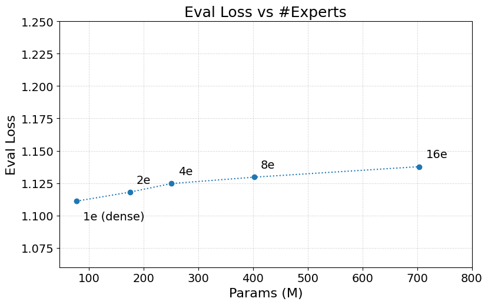
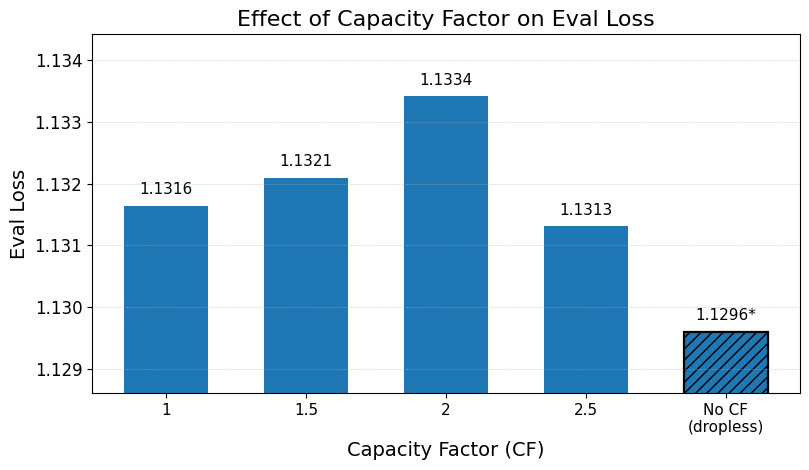
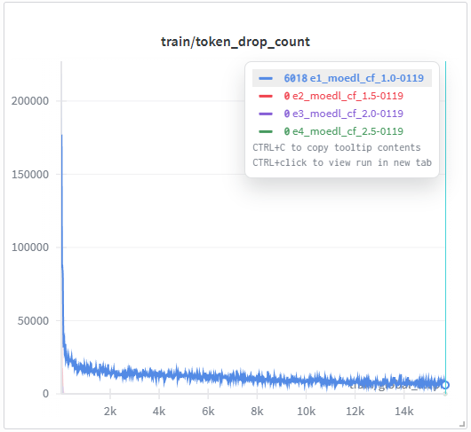

## MoE Ablations

**Jump to:**
* Load Balancing Strategy: Loss Penalty vs. Router Biasing
* Future Plans

---
**Motivation:** 

2025 is the year of reasoning and agents. It can also be argued as the year Mixture-of-Experts (MoE) models truly hit the mainstream. Virtually every flagship model from frontier labs is an MoE, although Google has been pioneering and popularizing the idea since [2017][og-moe-2017].

The beginning of 2025 was marked by the release of [DeepSeek R1][ds-r1], which demonstrated reasoning learned through pure RL. Its backbone is [DeepSeek V3, a 671B MoE][ds-v3]. [Qwen3 MoE][qwen3] arrived mid-year, followed by [OpenAI's GPT-OSS][gpt-oss-blog] in late August. The year closed with models such as [Kimi-K2][kimi-k2-report] and [Mistral Large 3][ml3-blog], which largely adopt DeepSeek V3–style architectures with an even larger number of experts.

Personally, I am particularly interested in understanding which components of MoE models contribute most to their efficacy beyond *just* scale and the conditional compute. My initial questions centered on how effective the load-balance biasing strategy used in DeepSeek V3 is compared to loss-based penalties. I did not encounter comparative study on this technique. *(I may have overlooked prior ablations and would appreciate pointers)*. I also questioned whether shared experts are truly mandatory, given that they introduce an additional engineering effort. While some prior work suggests they are not strictly required, I find the existing evidence not yet compelling *(though personally favor avoiding unremarkable additions)*. 

I intended to carry out these ablations using modest resources with HuggingFace (HF) Transformers. However, I could not find an implementation that exposes load balance biasing control. More importantly, there was no single MoE model type that allowed meaningful ablations while keeping most components consistent and only contrasting a single axis of design choices. For example, when comparing loss penalties versus biasing strategies for balancing expert load, I would like the attention layers to remain identical. DeepSeek V3 uses Multi-Latent Attention (MLA), which differs from the standard multi-head attention (MHA/MQA/GQA) used in models such as OLMoE or Qwen3, using existing implementations make direct comparisons unhygienic.

As a result, I decided to implement a new model type in local HF Transformers, `Moedl` (no pun intended!😝). This allows individual design choices to be turned on or off in a controlled manner while keeping the rest of the architecture fixed. While some features are still work in progress and certain ablations require larger resources, I believe there is now sufficient material to document the observations and findings.

**Hit the ground running with:**

* **Install**: clone and `make install-moelab` or `make install-dev-moelab`
* **Test**: `make run-tests`
* **Run**: 
    * `make <experiment-id>`, see [`Makefile`][mkfile]. Most experiments can fit within a single 80GB GPU. Each took about 3 hrs on a RTX Pro 6000 gpu.
        ```bash
        # Available make targets (Experiments)
        00_llama2_ref        b20_moedl_e4_k1_4ep  e1_moedl_cf_1.0
        01_moedl_dense       c1_moedl_e8_k1       e2_moedl_cf_1.5
        a0_moedl_no_lb       c2_moedl_e16_k2      e3_moedl_cf_2.0
        a1_moedl_lb_penalty  c3_moedl_e32_k4      e4_moedl_cf_2.5
        a2_moedl_lb_biasing  c4_moedl_e64_k8      gen-tinystories
        b1_moedl_e2_k1       d1_moedl_s0_k4_e32   gpulist-check-busy
        b2_moedl_e4_k1       d2_moedl_s1_k3_e31   install-dev-moelab
        b3_moedl_e8_k1       d3_moedl_s2_k2_e30   install-moelab
        b4_moedl_e16_k1      d4_moedl_s3_k1_e29   run-tests
        ``` 
    * **More customization**: use `moelab_main.py` like we use standard HF script. Do `python moelab_main.py --help` to see options.
    * **Find LR**: Appending `--sweep_lr <list of comma-limited lr>` to `moelab_main.py` will turn it into learning rate sweep over input values for small number of steps which can be configured with `--sweep_lr_steps <num_steps>`. For experiments in the [`Makefile`][mkfile], just append sweep_lr=1 to the make command. e.g. `make c1_moedl_e8_k1 sweep_lr=1`. A report will be generated in the output folder and metrics of respective sweare logged to wandb.

* All runs are shared on [W&B project][wbproj]. 

* Qualitative Eval per [TinyStories][ts-paper].
    ```bash
    make gen-tinystories ckpt=roneneldan/TinyStories-33M  # official dense GPTNeo model
    make gen-tinystories ckpt=vchua/moelab-e2-k1-4ep-tinystories  # moedl dense model
    make gen-tinystories ckpt=vchua/moelab-e4-k1-4ep-tinystories  # moedl moe model
    ```

---
### Scope and Implementation

Our objectives are:
1. To enable controlled ablations of key MoE design choices.
2. To support small-scale experiments that require only a single GPU and can be completed within a few hours.
3. To use a simple, accessible and familiar stack, entirely within the HuggingFace Transformers ecosystem.

#### [TinyStories][ts-paper]
All experiments use TinyStories, a synthetic [dataset][ts-ds] of short stories restricted to vocabulary typically understood by children of ages 3-4, generated using GPT-3.5 and GPT-4.

We choose TinyStories because the original paper demonstrates that models with as few as ~10M parameters can already learn to generate fluent and logically consistent stories. This allows us to bound both model size and training compute, keeping experiments feasible on a single GPU while still uncovering meaningful ablation trends. MoE models in this repo are typically a few hundred million parameters, mostly around 400M total parameters.

TinyStories is also easy to evaluate qualitatively: story coherence and logical consistency are readily observable, making it practical for comparing MoE ablations at small scale. In contrast, prior experience using GPT-2 or OPT models of similar scale trained on large, generic corpora often results in incoherent or unstructured generation, making qualitative comparison across models unreliable or infeasible.

We use the LLaMA-2 tokenizer for its smaller 32K vocabs. After tokenization, the training set contains approximately XXX tokens. We limit most experiments to 2 epochs, based on the diminishing returns of longer epochs observed in [*Scaling Data-Constrained LMs*][dc-illa].

#### [`Moedl` Configurables][MoedlCfg] & [Implementation][MoedlImpl]

This repo primarily focuses on the MoE layers. We need a smaller vocab given the property of TinyStories. Hence, we inherit from the `Llama` (LLaMA-2) architecture as the starting point, 32K vocab. Its attention stack also reflects the current standard: configurable GQA (MHA), RoPE, RMSNorm, and GLU-style MLPs. As a result, the standard LLaMA configurables are directly applicable to `Moedl`, including `hidden_size`, `intermediate_size`, `num_attention_heads`, `num_hidden_layers`, and related parameters.

`Moedl` can be configured as either a dense or an MoE model. As a sanity check, we train an equivalent LLaMA-2 dense model (`make 00_llama2_ref`) and a `Moedl` dense model (`make 01_moedl_dense`) on TinyStories. Equivalent training trajectories ensure architectural parity.

For MoE configurations, the following parameters can be varied:

* `num_experts`: number of experts per MoE layer, denoted as **E** throughout. If set to 0, a dense layer is used.
* `num_active_experts`: number of experts activated per token, denoted as **K** throughout.
* `num_shared_experts`: number of shared experts across all layers, denoted as **ES** throughout.
* `lb_coeff`: load-imbalance penalty coefficient. If set to 0, no loss-based penalty is applied.
* `lb_gamma`: router biasing update rate. If set to 0, bias-based control is disabled.
* No load balancing is applied when both `lb_coeff` and `lb_gamma` are set to 0.
* `capacity_factor`: expert capacity factor controlling token dropping. Setting this to 0 disables token dropping (i.e., dropless routing).

Tests are developed to verify against Olmoe and DeepSeek V3 to ensure MoE implementation correctness.

#### [`MoedlTrainer`][MoedlTrainer]

We subclass the HF `Trainer` to add MoE-specific training bookkeeping and logging, including routing statistics, expert load tracking, and fine-grained expert load heatmap generation with GIF collation. Of particular note is the `LoadBalanceBiasController`, which encapsulates router biasing control for load balancing; this is discussed in more detail in the load-balance strategy section. I encourage interested readers to review the [code][MoedlTrainer], which is self-explanatory with comments.

<!-- tests? -->

---
### Load Balancing Strategy 
> TLDR: Router biasing is surprisingly effective, easier to implement, requires less tuning!

Load balancing is crucial for MoE models to ensure that experts or more importantly the underlying devices are utilized effectively. By *load balance*, it simply means router's ability to distribute the incoming tokens evenly across all experts. Proper load balance allows computational work to be shared evenly across experts/devices, enabling parallelism and improving both training and inference efficiency.

#### Load Imbalance Penalty
Google has pioneered the use of an *auxiliary loss* added to the training objective to penalize load imbalance among experts, encouraging models to learn more even routing in order to achieve a lower overall training loss.

&emsp; $\mathcal{L} = \mathcal{L}_{\text{ce}} + \lambda \, \mathcal{L}_{\text{aux}}$ &emsp; 

&emsp; $\mathcal{L}_{\text{aux}} = E \sum_{e=1}^{E} f_e \, p_e$ &emsp; ── Eq.1 

&emsp; where &emsp; 
* $E$ is the number of experts
* $f_e$ is the fraction of tokens routed to expert $e$
* $p_e$ is the average router probability assigned to expert $e$ (router's softmax output, averaged over tokens and $k$ experts)

This technique is conceptually simple and closely resembles regularization. In our implementation, $\lambda$ is controlled by the `lb_coeff`.

#### Router Load Biasing ([DeepSeek v3][ds-v3])
Dubbed as *auxiliary loss-free load balancing*, DeepSeek V3 introduced an alternative approach that directly modifies the router logits (sigmoid output) with an additive *load-biasing term* before applying the Top-k assignment of experts. This biasing term is updated periodically based on the observed expert loads, effectively nudging the router to favor less-utilized experts.

&emsp; $\mathbf{s} = \sigma(W x) + \mathbf{b}_{\text{lb}}$ &emsp; ── Eq.2  
&emsp; *$\sigma$ is sigmoid instead of softmax.* &emsp;

&emsp; $\mathcal{K} = TopK(\mathbf{s}, K)$ &emsp;

&emsp; where &emsp;
* $\mathbf{s} \in \mathbb{R}^{E}$ is the biased router score vector over all experts (per token).
* $\mathbf{b}_{\text{lb}} \in \mathbb{R}^{E}$ is the load-balancing bias vector, initialized to $\mathbf{0}$ and updated periodically as:

&emsp; $\mathbf{b}_{\text{lb}} \leftarrow \mathbf{b}_{\text{lb}} + \gamma\,(\bar{\mathbf{f}} - \mathbf{f})$ &emsp; (every $N$ steps)

&emsp; where &emsp;
* $\mathbf{f} \in \mathbb{R}^{E}$ is the observed expert-load fraction averaged over $N$ steps.
* $\bar{\mathbf{f}} = \tfrac{1}{E}\mathbf{1}$ is the uniform target load.
* $\gamma$ is the bias update rate.

It is important to note that $b_{lb}$ does not participate in forward propagation other than modifying the router scores, hence does not affect the gradient computation. Its value is calibrated solely through the periodic update based on observed loads. If you are familiar with control systems, this is equivalent to a simple proportional controller operating directly on the routing imbalance error signal.

#### Ablation Results & Analysis
Setup: We ablate on `Moedl` with 8 experts (E=8) and 1 active expert per token (K=1) on TinyStories for 2 epochs We compare **no load balancing** (baseline), **imbalance penalty**, and **router biasing**.

| make [exp. id]               | Eval Loss |
|---------------------------   |:---------:|
| `a0_moedl_no_lb`             | 1.127     |
| `a1_moedl_lb_penalty`        | 1.137     |
| `a2_moedl_lb_biasing`        | 1.130     |

At first glance, all three strategies converge to similar final eval loss, with the best result achieved without load balancing, followed closely by router biasing, and finally the imbalance penalty. While the final loss differences are small, the load-balancing dynamics differ. To illustrate this, we examine expert load over time. The following plots, logged in W&B, show expert load averaged across experts and layers.

**Without load balancing**, expert imbalance is immediately apparent. A small subset of experts dominates the routing, as reflected by the disproportionate heights in the stacked plot and the uneven distributions in the % overlay view.


**Imbalance penalty** improves load distribution gradually over training. Between steps 2k and 10k, the % plot exhibit noticeably higher variance, indicating noisy and unstable routing before the auxiliary loss sufficiently regularizes expert utilization.


**Router biasing** yields the most stable behavior. Expert load converges rapidly toward a uniform distribution, with significantly tighter variance bounds in the % plot throughout training.


At this point, router biasing edges out the imbalance penalty (lower eval loss, tighter distribution variance), but not convincingly so. The *take-my-money* moment comes next: per-expert, per-layer load deviations from balance point visualized as animated heatmaps over training.


Examining the animated heatmaps, the advantage of router biasing becomes strikingly clear. Notice how  plain and less hot the color distribution remains throughout training. Router biasing rapidly achieves near-perfect uniform balance across experts and layers, with minimal deviation over time. In contrast, the imbalance penalty shows signs of expert collapse in later layers during the later stages of training, where certain experts remain consistently overloaded while others are underutilized. As expected, the no-load-balancing baseline exhibits imbalance hotspots across layers throughout training.

**Why** does router biasing work better? The auxiliary loss in Eq. (1) is a *globally* reduced scalar objective, a few localized imbalance signals may be too weak to meaningfully influence the overall loss. Router biasing, by contrast, applies control directly at a per-router level. Each expert is adjusted independently via a dedicated bias term, enabling more precise and effective correction.

While expert-specific coefficients could be introduced for the imbalance penalty, doing so requires additional tuning. Router biasing is simpler to implement and requires minimal tuning in practice. In my experience, tuning is straight forward, basically ensuring the bias update rate $\gamma$ is not overly large.

Based on these results, we adopt router biasing as the default load-balancing strategy for the remaining ablations.

### Scaling Number of Experts (E)

With a stable and effective load-balancing strategy in place, we now turn to the question of scale. Specifically, we examine how increasing the number of experts impacts overall model performance. Following [Switch Transformer][switch] study, we fix K=1, one activated expert per token to keep computation roughly constant to dense counterpart (aside from minor router overhead) and scale the number of experts by doubling from 1 to 16.

| make [exp. id]              | # Params | # Experts (E) | Eval Loss |
|-----------------------------|---------:|:-------------:|----------:|
| `01_moedl_dense`            |  77M     | 1             | 1.201     |
| `b1_moedl_e2_k1`            | 175M     | 2             | **1.118** |
| `b2_moedl_e4_k1`            | 251M     | 4             | 1.125     |
| `b3_moedl_e8_k1`            | 402M     | 8             | 1.130     |
| `b4_moedl_e16_k1`           | 704M     | 16            | 1.138     |
| `b20_moedl_e4_k1_4ep`       | 251M     | 4             | **1.083** |



This is a mixed result. All MoE variants outperform the dense baseline, confirming the effectiveness of MoE architectures in increasing model capacity while keeping per-token computation roughly constant. However, the 2-expert model achieves the best evaluation loss. This is somewhat unexpected, as we would anticipate continued gains when scaling to more experts (e.g., Fig. 1 in [Switch Transformer][switch]).

**Experts under-trained.** A likely explanation is expert undertraining at larger expert counts. In the dense setting, a single FFN sees approximately (B \times L \times N_{\text{steps}}) tokens during training. In an MoE model with (E) experts and (K=1), assuming balanced routing, these seen tokens are effectively partitioned across experts. As (E) increases, each expert sees fewer tokens, leading to under-trained experts. This is consistent with our results, which show deteriorating performance beyond (E=2).

**E=4 with 2× longer training.** To validate this hypothesis, we conduct an additional experiment with (E=4) experts trained for 4 epochs instead of 2 (`b20_moedl_e4_k1_4ep`). This model sees approximately the same number of tokens per expert as E=2 trained with 2 epochs, and indeed achieves the better evaluation loss of 1.083.

* to be continued ... *

---
### MoE Resolution (Expert Granuarity)

[DeepSeekMoE][ds-moe] is among the first to propose *fine-grained expert segmentation*, also referred to as *expert granularity*. The core idea is to **use smaller experts but more of them**. We prefer the term **resolution**, as it directly reflects the actual E:K config, and implicitly conveys the sparsity ratio.

The effectiveness of higher resolution can be reasoned about combinatorially. For a fixed sparsity ratio and approximately constant total model parameters, increasing resolution dramatically increases the number of possible expert combinations ($_EC_k$), see table below. Increasing the number of routing possibilities elevates model expressivity.

| make [exp. id]        | Resolution (E:K) | Combinations ($_EC_k$) | Eval Loss |
|-----------------------|:----------------:| ----------------------:|:---------:|
| `c1_moedl_e8_k1`      | 8:1              | 8                      | 1.1296    |
| `c2_moedl_e16_k2`     | 16:2             | 120                    | 1.0658    |
| `c3_moedl_e32_k4`     | 32:4             | 35,960                 | **1.0581**|
| `c4_moedl_e64_k8`     | 64:8             | 4,426,165,368          | 1.0584    |

We ablate MoE models at a fixed sparsity ratio of 12.5% while increasing resolution: E:K = 8:1, 16:2, 32:4, and 64:8. Total model parameters are kept approximately constant at 400M by adjusting the expert hidden size. The benefit of higher resolution is clearly observed empirically: as resolution increases, model performance improves. However, the gains eventually saturate, we attribute the diminishing returns to under-training of smaller experts or data starvation. Our observed trends are consistent with prior results reported in [DeepSeekMoE's Table 1][ds-moe] and [OLMoE ablations (Fig. 5)][olmoe].

### Are Shared Experts Mandatory?

In addition to finer-grained experts, [DeepSeekMoE][ds-moe] also advocates the use of *shared experts*, where a subset of experts is activated for every token. The rationale is that certain forms of common knowledge may be universal, and sharing experts could reduce parameter redundancy and improve learning efficiency.

While this intuition is appealing, [OLMoE (4.1.3)][olmoe] highlights a potential confound to the combinatorial argument. Shared experts are essentially fixed routing paths and contribute no additional combinations. At iso-active-expert settings, introducing shared experts effectively reduces the number of unique experts available for combination, which may be counter-productive for model expressivity (see Table).

Empirical results in the literature are mixed. The proposer [DeepSeekMoE (Fig.3,6)][ds-moe] reports benefits from shared experts whereas [OLMoE (4.1.3)][olmoe] observes limited or negative impact. [NVIDIA's ablations][] show similar convergence behavior with and without shared experts, though in the specific context of upcycling a Nemotron-4 dense model into an MoE. Notably, most prior studies explore shared experts in a binary on/off setting.

Given the lightweight nature of our setup, we are able to explore this design axis more thoroughly by varying the number of shared experts while holding total active experts constant. Our baseline is E=32, K=4, 400M parameters with XX active. We vary the number of shared experts from 0 to 3, adjusting the unique experts accordingly to maintain a total of 4 active experts.

| make [exp. id]             | Shared (ES) | E  | K | Active Experts | Combinations ($_EC_k$) | Eval Loss |
|----------------------------|:-----------:|---:|--:|:--------------:|-----------------------:|:---------:|
| `d1_moedl_s0_k4_e32-0119`  | 0           | 32 | 4 | 4              | 35,960                 | 1.0581    |
| `d2_moedl_s1_k3_e31-0119`  | 1           | 31 | 3 | 4              | 4,495                  | **1.0573**|
| `d3_moedl_s2_k2_e30-0119`  | 2           | 30 | 2 | 4              | 435                    | 1.0600    |
| `d4_moedl_s3_k1_e29-0119`  | 3           | 29 | 1 | 4              | 29                     | 1.1014    |

**Results:** The overall trend suggests that more shared experts lead to worse performance aligning to the combinatorial argument. Yet the best result is achieved with 1 shared expert (ES=1) by just tiny margin (0.0008) over no shared experts (ES=0). This small gain may be attributed to dataset characteristics such as limited scale or diversity in TinyStories, leading to under-training of non-shared experts.

**Personal take:** In my view, the benefit of shared experts, if any, appears marginal. Rather than allocating capacity to shared experts, I would prefer to expand the main trunk by widening layers or adding depth to **preserve** symmetry within MoE blocks. Conceptually, these approaches serve a similar purpose, applying a common transformation to every token.

Moreover, shared experts can be viewed as inherently load-imbalanced, as they are activated for every token by design. The practical ramifications of this behavior remain unclear (at least to me at the moment). As such, we do not recommend shared experts as a default design choice.

### Limiting Expert Capacity: To Drop Tokens or Not? Don’t.

Since the early days of MoE research, Google has employed fixed expert capacity, largely because TPUs and the XLA compiler require tensor shapes to be known statically; dynamically varying token counts at runtime are challenging to support. By expert capacity, each expert is allowed to process only a limited number of tokens during routing. Tokens exceeding this capacity are dropped, i.e., they are not processed by any expert.

Concretely, the **capacity factor (CF)** controls this limit:

`expert_capacity = (Tokens_per_batch * K / E)  ×  CF`

In plain terms, CF = 1.0 restricts each expert to the average expected token load under perfectly balanced routing. Increasing CF allows experts to handle more tokens beyond this average. For example, CF = 2.0 permits each expert to process up to 2x the average load, reducing the likelihood of token dropping in imbalance routing.

Following the vein of [MegaBlocks][megablocks], we ablate the effect of token dropping on Moedl with resolution E:K = 8:1 by sweeping the capacity factor (CF) from 1.0 to 2.5 in increments of 0.5. Note that our setup differs in load balancing: we use router biasing, whereas MegaBlocks uses an auxiliary load-balancing objective. Run `make e1 .. e4` for the CF sweeps, and refer `a2` / `b3` for the dropless setting (CF disabled).





**Dropping tokens is detrimental.** The dropless setting (CF disabled) outperforms all CF configurations. Among the CF runs, the highest CF (2.5) which minimizes token dropping performs best, consistent with the idea that fewer dropped tokens leads to better learning.

To make this concrete, we enclose the total number of dropped tokens over training. With CF=1.0, the model continues to drop tokens throughout training, ending at ~6K+ dropped tokens aggregated across layers (roughly ~1% of all tokens). In contrast, CF=1.5/2.0/2.5 quickly converge to near-zero dropped tokens. This also suggests router biasing already routes tokens effectively, experts do not hit extra expert capacity (higher CF).

A little nuance, CF=1.5 and CF=2.0 converge slightly worse than CF=1.0. We suspect this is variance, or that early-stage token dropping can have lasting impact on model learning. Regardless, the trend is clear: **token dropping is not beneficial.** Also crucially, router biasing effectively mitigates expert overload, making capacity-based token dropping unnecessary. *So, don't drop tokens!*

---

### Conclusion

Our ablations suggest: Use router biasing for load balancing. Prefer MoE with higher resolution - small experts, more of them, but watch for diminishing returns. Skip shared experts and token dropping.


---
### Future Plans


[mkfile]: ./Makefile
[wbproj]: https://wandb.ai/vchua/moe-lab
[MoedlCfg]: ./src/moelab/moedl/configuration_moedl.py
[MoedlImpl]: ./src/moelab/moedl/modeling_moedl.py
[MoedlTrainer]: ./src/moelab/moedl/trainer.py

[megablocks]: http://arxiv.org/abs/2211.15841
[ds-moe]: http://arxiv.org/abs/2401.06066
[ds-r1]: https://arxiv.org/abs/2501.12948
[ds-v3]: https://arxiv.org/abs/2412.19437
[qwen3]: https://arxiv.org/abs/2505.09388
[gpt-oss-blog]: https://openai.com/index/introducing-gpt-oss/
[switch]: https://arxiv.org/abs/2101.03961
[olmoe]: https://arxiv.org/abs/2409.02060
[ec-paper]: https://arxiv.org/abs/2202.09368
[ml3-blog]: https://mistral.ai/news/mistral-3
[kimi-k2-report]: https://github.com/MoonshotAI/Kimi-K2/blob/main/tech_report.pdf
[og-moe-2017]: https://arxiv.org/abs/1701.06538 
[ts-paper]: http://arxiv.org/abs/2305.07759
[ts-ds]: https://huggingface.co/roneneldan/TinyStories-33M
[nv-upcycle]: http://arxiv.org/abs/2410.07524
[dc-illa]:http://arxiv.org/abs/2305.16264

